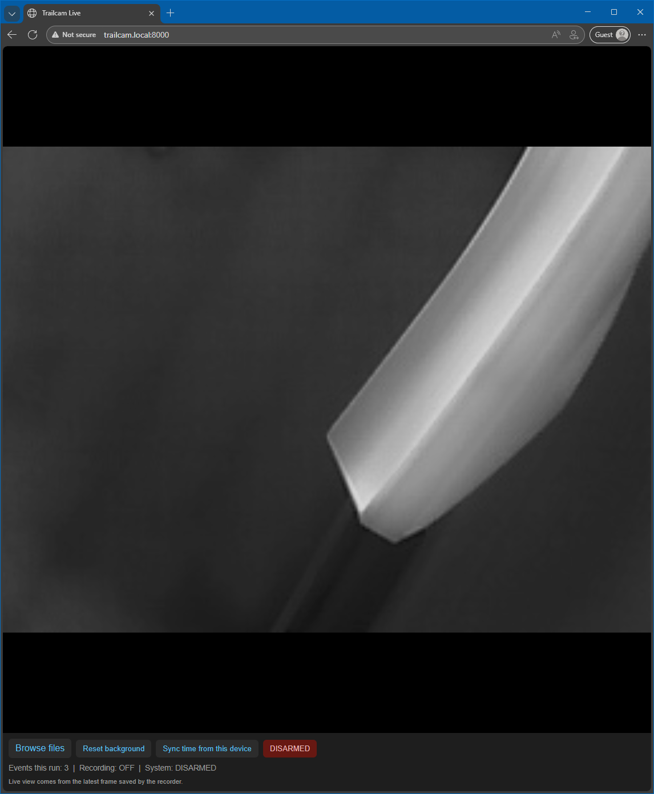
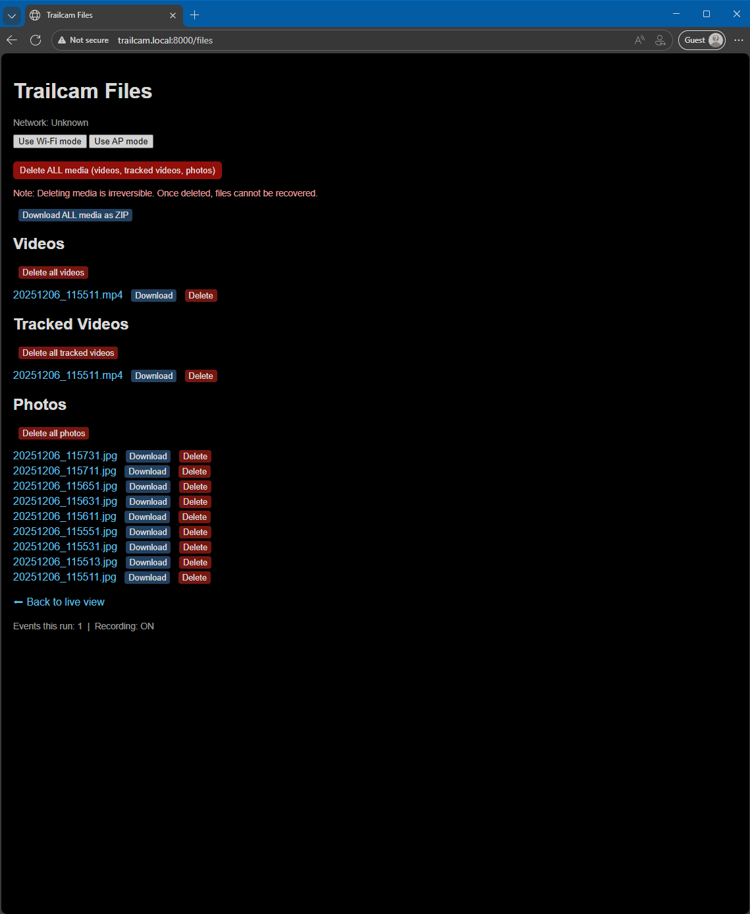

# Trailcam-Raspberry-Pi-5-Topdon-Thermal-Camera-TC001-

Trailcam is a Raspberry Pi–based trail camera / thermal recorder project.

It consists of:

- `main.py` – the recorder / motion logic that:
  - grabs frames from the camera,
  - runs detection / background subtraction,
  - saves photos/videos into a media directory,
  - writes `status.json` for the web UI.
- `webapp.py` – a lightweight Flask web interface that:
  - shows a live MJPEG view using `live.jpg`,
  - lets you browse/download/delete photos and videos,
  - offers a "Download all media as ZIP" button,
  - exposes a "Reset background" button for the recorder.

Networking is set up so the Pi can run as a **Wi-Fi access point** (AP mode), with:
- SSID like `Topdon TrailCam` (configured via `hostapd.conf`)
- Static AP IP `192.168.4.1`
- Web interface at `http://trailcam.local:8000/` or `http://192.168.4.1:8000/` when connected to the AP

Ethernet works as a backup path: if both your PC and Pi are on the same wired LAN, you can still reach:
- `ssh kasper@trailcam.local`
- `http://trailcam.local:8000/`

> **NOTE:** This repo contains configuration *templates* for hostapd/dnsmasq and systemd services. You may need to adjust usernames, paths, and SSIDs for your own Pi.

---

## Features

- MJPEG live view from `live.jpg`
- File browser for:
  - raw videos (`/home/<user>/media/videos`)
  - processed / tracked videos (`/home/<user>/media/videos_tracked`)
  - photos (`/home/<user>/media/photos`)
- Per–file download + delete
- "Delete all" buttons (with warning) for each category and all media
- "Download ALL media as ZIP" button
- Background reset hook via a simple flag file
- Optional: Wi-Fi AP with static IP & DHCP via hostapd + dnsmasq
- systemd units to run the recorder and web server at boot

---

## Directory structure (runtime on the Pi)

By default, the recorder and webapp expect:

```text
/home/<user>/media/
├── photos/
├── videos/
├── videos_tracked/
├── live.jpg         # latest frame for live MJPEG view
└── status.json      # small JSON with {"recording": bool, "events": int}
```

 - Replace <user> with your actual Linux username (e.g. kasper or pi).
 - You can change paths in main.py and webapp.py if you prefer a different layout.

---

## Web Interface Preview

### Live View


### File Browser


---

## 3D Printed Parts

The 3D parts used for the camera mount are available here:

- [STL file](3d_models/Trailcam_3D.stl)
- [STEP file](3d_models/Trailcam_3D.step)
- [Fusion 360 file (F3D)](3d_models/Trailcam_3D.f3d)

---

## Installation

Clone the repository to your Pi:

```bash
cd ~
git clone https://github.com/<your-username>/trailcam.git
cd trailcam
```

Create and activate a virtual environment (optional but recommended):

```bash
python3 -m venv .venv
source .venv/bin/activate
pip install -r requirements.txt
```

Make sure your camera and other dependencies are correctly set up  
(Topdon TS004 / thermal camera, OpenCV, etc.) as required by `main.py`.

---

## Running manually

### Web UI

```bash
cd ~/trailcam
python3 webapp.py
```

The app listens on **0.0.0.0:8000**, so you can visit:

- http://trailcam.local:8000/ (if mDNS is set up and your client supports `.local`)
- http://192.168.4.1:8000/ when connected to the Pi’s AP
* `http://<ethernet-ip>:8000/` if using Ethernet


### Recorder

In another terminal:

```bash
cd ~/trailcam
python3 main.py
```

---

## Running with systemd (recommended)

This repo includes example systemd service files in `systemd/`:

- **wlan0-ap-ip.service** – sets `192.168.4.1/24` on wlan0 at boot  
- **trailcam-recorder.service** – runs `main.py` at boot  
- **trailcam-web.service** – runs `webapp.py` at boot  

To install them:

```bash
sudo cp systemd/*.service /etc/systemd/system/
sudo systemctl daemon-reload

sudo systemctl enable wlan0-ap-ip.service
sudo systemctl enable trailcam-recorder.service
sudo systemctl enable trailcam-web.service

sudo systemctl start wlan0-ap-ip.service
sudo systemctl start trailcam-recorder.service
sudo systemctl start trailcam-web.service
```

**Make sure you edit the `ExecStart=` paths inside each service**  
to match where you cloned the repo and the user you run as.

---

## Wi-Fi AP configuration

Example configuration templates are in `config/`:

- `hostapd.conf.example`  
- `dnsmasq-trailcam.conf.example`

---

### On the Pi

#### Install required packages:

```bash
sudo apt update
sudo apt install hostapd dnsmasq avahi-daemon -y
```

#### Copy and edit configs:

```bash
sudo cp config/hostapd.conf.example /etc/hostapd/hostapd.conf
sudo cp config/dnsmasq-trailcam.conf.example /etc/dnsmasq.d/trailcam.conf

sudo nano /etc/hostapd/hostapd.conf
sudo nano /etc/dnsmasq.d/trailcam.conf
```

#### Enable hostapd and dnsmasq:

```bash
sudo systemctl enable hostapd dnsmasq
sudo systemctl restart hostapd dnsmasq
```

#### Enable mDNS (for `trailcam.local`):

```bash
sudo systemctl enable --now avahi-daemon
```

---

## Accessing the Web Interface

When connected to the Pi’s AP (e.g. **Topdon TrailCam**):

- http://192.168.4.1:8000/

With mDNS (Windows/macOS/iOS support):

- http://trailcam.local:8000/

